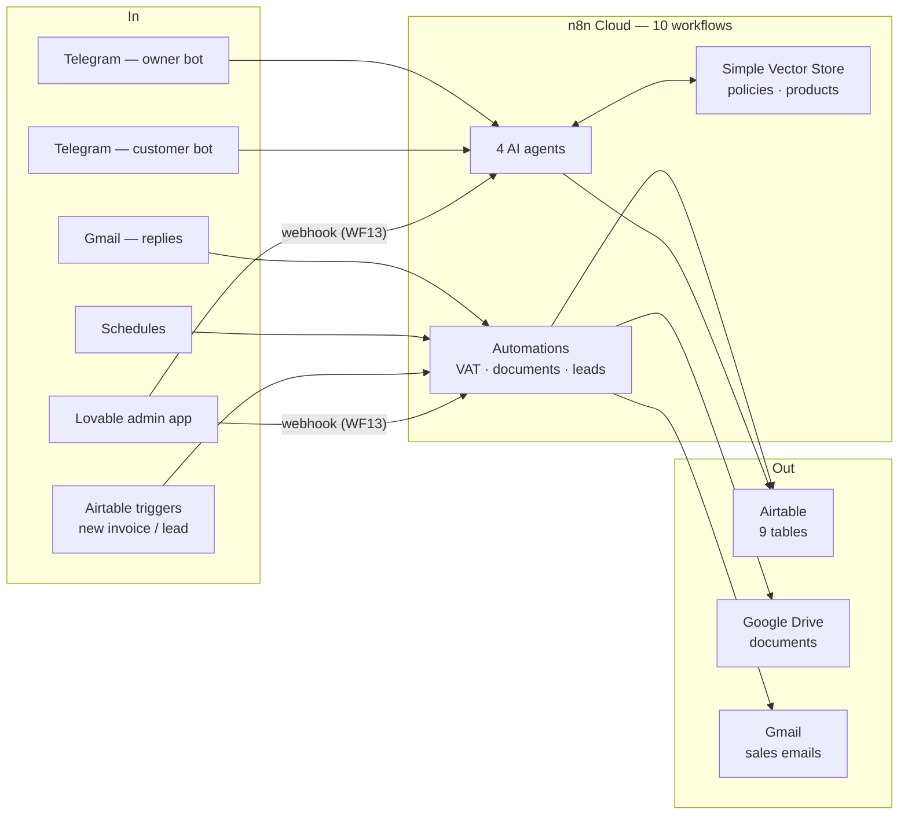
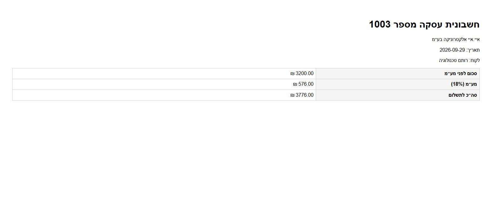
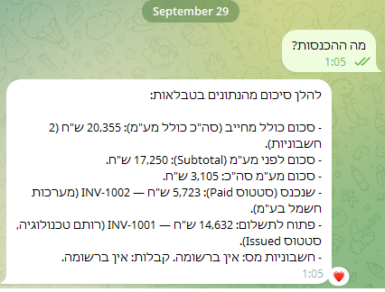
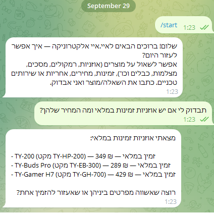

# AI-ERP with n8n

A small, learning-oriented ERP for a fictional Israeli electronics business (איי.איי אלקטרוניקה) — built on **n8n Cloud** and **Airtable**, with AI agents, RAG over the business policies and product catalog, two Telegram bots, Gmail, Google Drive, and an admin app built in **Lovable**. Final project for the AI & Automation course (53500).

Everything runs in the cloud. Nothing to install, nothing to run locally, no server to deploy — and **no Code nodes**: every workflow is built from ready-made n8n nodes.

| | | | | |
|:---:|:---:|:---:|:---:|:---:|
| **10** workflows | **4** AI agents | **9** Airtable tables | **0** Code nodes | **18%** VAT |

## What's in the box

- **4 AI agents** — a **manager** agent (owner-only Telegram bot with tools for tasks, invoices and documents), a **customer service** agent (RAG over policies + products), a **sales** agent (cold emails + reply handling), and an **app gateway** agent for the admin app's chat.
- **10 n8n workflows** — tax-document validation, lead intake, sales, two RAG ingestion pipelines, document generation, the two bots, and the app gateway.
- **RAG on n8n's Simple Vector Store** — two in-memory stores (`policies`, `products`), embedded with OpenAI `text-embedding-3-small`, queried through the AI Agent's *Answer questions with a vector store* tool.
- **Israeli tax rules** — 18% VAT from 01/01/2025 (17% before), running document numbers, invoice / tax invoice / receipt kept apart, a business number required on tax invoices, Hebrew RTL documents in Google Drive.
- **Airtable as the single database** — 9 tables: Customers, Leads, Products, Orders, Invoices, TaxInvoices, Receipts, Tasks, Files.
- **An admin app built in Lovable** — dashboard, table screens, create forms and an agent chat, all through one n8n webhook (WF13); the app never holds an Airtable key.

## Architecture



A document created anywhere (Airtable, the manager bot, the app) is validated by **WF1**, queued in **Files**, and rendered to Google Drive by **WF8** right away; the Drive link is written back to the document and shown in the app. A new lead is de-duplicated by **WF3**, emailed by **WF4a**, and its reply is answered by **WF4b**. **WF6/WF7** fill the vector store that **WF5**, **WF9** and **WF13** search.

### Models

Both are set in the **OpenAI** credential in n8n:

- **Chat** — `gpt-5-mini` for every agent and the sales emails.
- **Embeddings** — `text-embedding-3-small` (multilingual, so Hebrew embeds well) in WF5, WF6, WF7, WF9 and WF13. It must be the same model everywhere the `policies` / `products` stores are written and read.

## Quick start

1. **Accounts** — n8n Cloud, Airtable, OpenAI, two Telegram bots from @BotFather (owner + customers), and a Google account for Gmail + Drive.
2. **Credentials in n8n** — six connections: Airtable, OpenAI, Telegram (owner), Telegram (customers), Gmail, Google Drive — see [docs/04](docs/04-workflows.md#create-the-credentials-first).
3. **Airtable** — build the `AI-ERP` base with 9 tables and a `Created` field on the trigger tables — [docs/01](docs/01-airtable.md) and [`schema/schema.json`](schema/schema.json).
4. **Telegram** — create both bots, one credential each, and find your own chat id — [docs/02](docs/02-telegram-bots.md).
5. **Google** — one OAuth client for Gmail + Drive — [docs/03](docs/03-google-oauth.md).
6. **Workflows** — build them following [docs/04](docs/04-workflows.md): pick your base and table in every Airtable node, pick the credential in every node, put your chat id in WF9's `Is Owner?`.
7. **Fill the vector store** — run **WF6** (the policy text is inside its `עריכת שדות` node) and **WF7** (products from Airtable), one click each. ⚠️ Re-run both after every n8n restart.
8. **Publish** WF1, WF3, WF4a, WF4b, WF5, WF8, WF9, WF13.
9. **App** — build it in Lovable with the brief's prompt and store the WF13 production URL as the secret `N8N_WEBHOOK_URL` — [docs/05](docs/05-app.md).

### Try it

- **Customer bot:** *"מה מדיניות ההחזרות?"* · *"יש אוזניות אלחוטיות במלאי?"*
- **Owner bot:** *"מה ההכנסות?"* · *"תיצור משימה להתקשר לספק מחר"*
- **App:** create an invoice with a customer and an amount → WF1 checks the VAT → WF8 puts the document in Drive → the "מסמך" link appears in the app within seconds.
- **Everything else** is in **Executions**: every run, green or red, with the data that passed between the nodes. The full test run is in [docs/07](docs/07-end-to-end-tests.md).

## The workflows

| # | Name | Trigger | What it does |
|---|------|---------|--------------|
| WF1 | Tax Doc Validation | New Invoice / TaxInvoice / Receipt in Airtable | checks VAT, amounts and required fields → queues the document for WF8, or marks it Invalid with the reason |
| WF3 | Contact Intake | New Lead in Airtable | closes a lead whose email already belongs to an older lead |
| WF4a | Sales Cold Emails | Every 3 hours | one `New` lead → personal Hebrew email (HTML) → `Contacted` |
| WF4b | Sales Reply Check | Gmail, every minute | a lead's reply → agent answers in the same thread → `Replied` |
| WF5 | Customer Service | Telegram (customer bot) | RAG agent over policies and products |
| WF6 | Policies Embedding | Manual | the 12 policy topics → vector store `policies` |
| WF7 | Products Embedding | Manual | the 34 products → vector store `products` |
| WF8 | File Pipeline | Called by WF1 (+ hourly) | Hebrew RTL document → Google Drive → link in `PdfUrl` |
| WF9 | Manager Agent | Telegram (owner bot) | revenue, documents, tasks, policies — owner only |
| WF13 | App Gateway | Webhook from the Lovable app | `list` / `create` / `chat` for the app |

Node by node, with a diagram and a run screenshot of each: [docs/04-workflows.md](docs/04-workflows.md).

## The system in action

The admin app — dashboard, and the invoices screen with the Drive link WF8 wrote back:


The invoice document WF8 generated (INV-1003: 3,200 ₪ + 18% VAT):



The owner bot answering "מה ההכנסות?" from Airtable, and the customer bot answering from the catalog:





WF8 after a real run — every node green:


## Repo layout

```
├── docs/
│   ├── 01-airtable.md          base, credential, tables, Created fields
│   ├── 02-telegram-bots.md     the two bots, chat id, owner check
│   ├── 03-google-oauth.md      Gmail + Drive OAuth
│   ├── 04-workflows.md         the 10 workflows: credentials, run order, diagrams, node tables
│   ├── 05-app.md               the Lovable app: prompt, API contract, screens
│   ├── 06-tax-and-vat.md       VAT, running numbers, document types, validation rules
│   ├── 07-end-to-end-tests.md  the tests I ran, with execution numbers
│   └── screenshots/            runs of every workflow, the app, Airtable, Drive, the bots
├── mock/policies/              the 12 policy texts (a readable copy of what lives in WF6)
├── schema/schema.json          the 9 Airtable tables and the vector store keys
├── templates/                  invoice / tax invoice / receipt HTML (Hebrew RTL), as WF8 renders them
├── AGENTS.md                   notes for anyone (human or AI) editing this repo
└── README.md                   this file
```

Nothing here is deployed or executed. The repo holds the schema, the content the workflows use, and the guides — the workflows themselves live in n8n Cloud (no exports in git; they carry ids like the owner's chat id).

## Known limitations (intentional)

- **In-memory vector store and agent memory** — Simple Vector Store and the chat memory are wiped whenever n8n restarts. Re-run WF6 and WF7.
- **No PDF conversion** — the brief rules out an external conversion service, so documents are HTML on Google Drive (open in Google Docs → Download → PDF).
- **No error handling or retries** — a failed execution shows up red in **Executions**, on purpose (the one exception: WF13's Airtable read retries on Airtable's rate limit).
- **Airtable triggers poll every minute** and rely on a `Created time` field.
- **Running document numbers can collide** if two documents are created within the same polling window.
- **Google OAuth stays in Testing mode** — refresh tokens expire every 7 days.
- **WF4a sends one lead per run**, so a mistake can't send dozens of emails.
- **Relationships are text foreign keys** (`CUST-0001`), not Airtable links.
- **The app**: one user, no permissions, no cache; Airtable's ~5 requests/second limit caps heavy dashboards.

## Docs

1. [Airtable](docs/01-airtable.md) · 2. [Telegram bots](docs/02-telegram-bots.md) · 3. [Google OAuth](docs/03-google-oauth.md) · 4. [Workflows](docs/04-workflows.md) · 5. [Admin app](docs/05-app.md) · 6. [Tax & VAT](docs/06-tax-and-vat.md) · 7. [End-to-end tests](docs/07-end-to-end-tests.md)

## Credits

Project structure follows the course reference repo [tomerfooks/jb-erp-ai](https://github.com/tomerfooks/jb-erp-ai), built independently for the same assignment.
