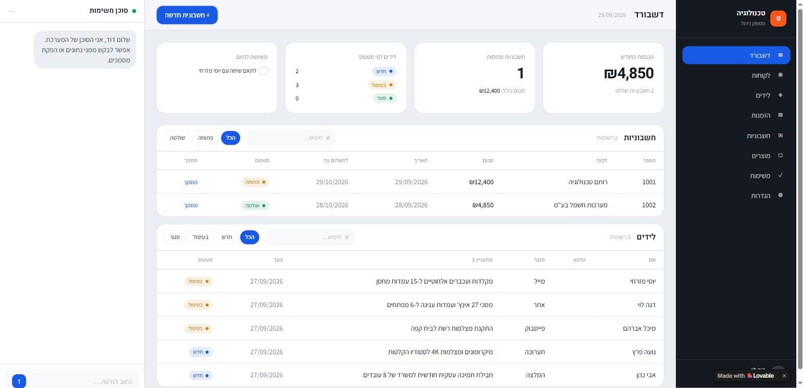

# AI-ERP with n8n

A small, learning-oriented ERP system for a fictional Israeli electronics business (איי.איי אלקטרוניקה) — built entirely on **n8n Cloud** and **Airtable**, with AI agents, RAG over the business policies and product catalog, two Telegram bots, Gmail and Google Drive. Final project for the AI & Automation course.

Everything runs in the cloud. Nothing to install, nothing to run locally, no server to deploy.

## What's in it

- **4 AI agents** — a manager agent (owner-only Telegram bot with tools for tasks, invoices and documents), a customer service agent (RAG over policies + products), a sales agent (cold outreach + reply handling), and an app gateway agent for the admin app.
- **10 n8n workflows** covering tax-document validation, lead intake, sales, RAG ingestion, document generation, and the two bots.
- **RAG on n8n's Simple Vector Store** — two in-memory stores (`policies`, `products`), embedded with OpenAI `text-embedding-3-small`, queried through the AI Agent's *Answer questions with a vector store* tool.
- **Israeli tax rules built in** — 18% VAT from 01/01/2025 (17% before), a business number required on tax invoices, running document numbers, Hebrew RTL documents.
- **Airtable as the single database** — 9 tables: Customers, Leads, Products, Orders, Invoices, TaxInvoices, Receipts, Tasks, Files.
- **An admin app built in Lovable** — dashboard, table screens, create forms and an agent chat, all through one n8n webhook (WF13); the app never holds an Airtable key.

## Architecture

```
                     ┌──────────────────────────────┐
 Telegram (owner)    │                              ├──► Airtable      (all data, 9 tables)
 Telegram (customer) │                              │
 Gmail            ──►│          n8n Cloud           ├──► Gmail         (sales emails)
 Airtable triggers   │   (workflows + AI agents)    │
 Schedule triggers   │                              ├──► Google Drive  (generated documents)
 Admin app webhook   │                              │
                     └──────────────┬───────────────┘
                                    │
                                    ▼
                       Simple Vector Store (in n8n)
                         policies  ·  products
```

A document created anywhere (Airtable, the manager bot, the app) is validated by **WF1**, queued in **Files**, and rendered to Google Drive by **WF8** right away; the Drive link is written back to the document and shown in the app. A new lead is de-duplicated by **WF3**, emailed by **WF4a**, and its reply is answered by **WF4b**. **WF6/WF7** fill the vector store that **WF5**, **WF9** and **WF13** search.

## Quick start

1. **Accounts**: n8n Cloud, Airtable, OpenAI, two Telegram bots via @BotFather, a Google account for Gmail + Drive.
2. **Airtable**: build the `AI-ERP` base with 9 tables and a `Created` field in each — see [`docs/01-airtable.md`](docs/01-airtable.md) and [`schema/schema.json`](schema/schema.json).
3. **Telegram**: create both bots, one credential each — see [`docs/02-telegram-bots.md`](docs/02-telegram-bots.md).
4. **Google**: connect Gmail + Drive OAuth2 credentials — see [`docs/03-google-oauth.md`](docs/03-google-oauth.md).
5. **n8n**: build the workflows and pick the credentials in each node — see [`docs/04-workflows.md`](docs/04-workflows.md).
6. **Fill the vector store**: run WF6 (the policy text is inside its `עריכת שדות` node) and WF7 (products from Airtable) — one click each.
7. Activate WF1, WF3, WF4a, WF4b, WF5, WF8, WF9, WF13. Try the customer bot ("מה מדיניות ההחזרות?", "כמה עולה מסך 27 אינץ'?") and the owner bot ("מה ההכנסות?").
8. **App**: build it in Lovable with the prompt from the course brief and store the WF13 production URL as the secret `N8N_WEBHOOK_URL`.

## Repo layout

```
├── docs/            setup guides: Airtable, Telegram, Google OAuth, and the workflow map
│   └── screenshots/ one screenshot per n8n workflow, plus the app and example conversations
├── mock/policies/   a readable copy of the policy text that lives in WF6
├── schema/          schema.json - the 9 Airtable tables and the vector store keys
├── templates/       the document template WF8 renders
├── AGENTS.md        notes for anyone (human or AI) editing this repo
└── README.md        this file
```

## The workflows

See [`docs/04-workflows.md`](docs/04-workflows.md) for the node-by-node flow, credentials, and a screenshot of every workflow.



| # | Name | Trigger |
|---|------|---------|
| WF1 | Tax Doc Validation | New Invoice / TaxInvoice / Receipt in Airtable |
| WF3 | Contact Intake | New Lead in Airtable |
| WF4a | Sales Cold Emails | Every 3 hours |
| WF4b | Sales Reply Check | Gmail, every minute |
| WF5 | Customer Service | Telegram (customer bot) |
| WF6 | Policies Embedding | Manual |
| WF7 | Products Embedding | Manual |
| WF8 | File Pipeline | Called by WF1 (+ hourly) |
| WF9 | Manager Agent | Telegram (owner bot) |
| WF13 | App Gateway | Webhook from the Lovable app |

## Known limitations (intentional)

- **In-memory vector store** — Simple Vector Store is wiped whenever n8n restarts. Re-run WF6 and WF7 afterwards.
- **No PDF conversion** — the brief rules out an external conversion service, so documents are HTML on Google Drive (open in Google Docs → Download → PDF).
- **No error handling or retries** — a failed execution shows up red in n8n's **Executions** tab, on purpose.
- **Google OAuth stays in Testing mode** — refresh tokens expire every 7 days.
- **Running document numbers can collide** if two documents are created within the same polling window.

## Credits

Project structure inspired by [tomerfooks/jb-erp-ai](https://github.com/tomerfooks/jb-erp-ai), built independently for the same course assignment.
