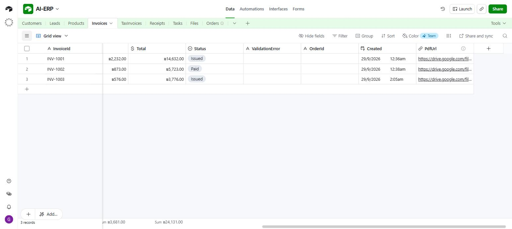
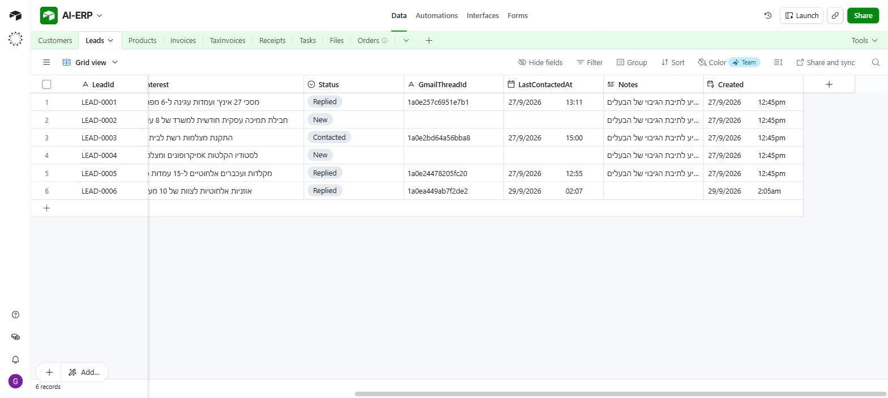

# 1. Airtable setup

The Airtable base is the database: 9 tables — Customers, Leads, Products, Orders, Invoices, TaxInvoices, Receipts, Tasks, Files. You build them yourself from [`schema/schema.json`](../schema/schema.json), then add the `Created` trigger fields.

## Create the base

1. Go to [airtable.com](https://airtable.com) and create a new **empty base**. Call it `AI-ERP`.
2. Open it and note the **base id** from the URL — the part starting with `app`:
   `https://airtable.com/`**`appXXXXXXXXXXXXXX`**`/tblYYY/viwZZZ`
3. The default `Table 1` can be renamed or deleted — you build your own tables.

## Connect it to n8n

Either credential type works; this project uses **OAuth2**.

- **Airtable OAuth2** (used here): n8n → Credentials → Add credential → *Airtable OAuth2 API* → Connect → grant access to the **AI-ERP** base. The grant is per base: a base you create later is not included automatically — reconnect and add it.
- **Personal Access Token**: <https://airtable.com/create/tokens> → Create new token → scopes `data.records:read`, `data.records:write`, `schema.bases:read`, `schema.bases:write` → access: the `AI-ERP` base → paste the token (`pat...`) into an *Airtable Personal Access Token* credential. You only see it once.

Either way the key lives only in n8n. The admin app never gets it — it goes through WF13 ([docs/05](05-app.md)).

## Build the tables

Create the 9 tables following `schema/schema.json` — it lists every table, field name and field type, and which workflows use each table. Field types map to Airtable directly: `text`, `longtext`, `email`, `phone`, `url`, `int`, `currency` (₪), `percent`, `date`, `datetime`, `select` (with `choices`), and `created` (the "Created time" field below). The first field in each table is the primary field.

| Table | Used by | Key fields |
|---|---|---|
| Invoices | WF1 (trigger), WF8, WF9, WF13 | `InvoiceId`, `DocNumber`, `CustomerName`, `IssueDate`, `Subtotal`, `VATRate`, `VATAmount`, `Total`, `Status`, `PdfUrl`, `Created` |
| TaxInvoices | WF1 (trigger), WF8, WF9 | as Invoices + `CustomerBusinessNumber` (required) |
| Receipts | WF1 (trigger), WF8, WF9 | `Amount`, `PaymentMethod`, `RelatedInvoice`, `PdfUrl` |
| Leads | WF3 (trigger), WF4a, WF4b, WF13 | `LeadId`, `Name`, `Email`, `Company`, `Status`, `GmailThreadId`, `LastContactedAt`, `Created` |
| Products | WF7, WF13 | `ProductId`, `SKU`, `Name`, `Category`, `Price`, `Stock`, `Warranty`, `Description`, `Status` |
| Tasks | WF9, WF13 | `TaskId`, `Title`, `AssignedTo`, `DueDate`, `Priority`, `Status` |
| Files | WF1 (writes), WF8 (reads) | `FileId`, `DocType`, `SourceRecordId`, `Status`, `DriveLink` |
| Customers, Orders | WF13 (the app) | `CustomerId`, `Name`, `Email` · `OrderId`, `CustomerName`, `Items`, `Amount`, `Status` |

The course brief's minimum is four tables (Invoices, Leads, Products, Tasks). This project uses nine so it can also keep tax invoices, receipts and the document queue apart, and so the app has customers and orders screens.

The base ships empty. Records are added as you work: from the app, from the manager bot, or by hand.

## ⚠️ Add the `Created` fields by hand

Airtable's API **cannot create "Created time" fields**. The n8n Airtable Triggers need one to detect new records, so add it manually to **Invoices, TaxInvoices, Receipts and Leads** (the other tables have one too, but nothing triggers off them):

1. Open the table → click **＋** at the right end of the field row.
2. Choose field type **Created time**.
3. Name it exactly **`Created`**.

Without it the triggers in WF1 and WF3 never fire.

## Notes

- **Relationships are plain text ids**, not Airtable links: `Invoices.CustomerId` holds `"CUST-0001"` — simpler, and easier to show in the app.
- **Running ids**: records created from the app get them from WF13 (`CUST-0001`, `LEAD-0006`, `ORD-0001`, `P-035`, `TASK-0001`; invoices `INV-1001` with `DocNumber` 1001, 1002, …).
- **`VATRate` is a percent field** stored as a fraction: `0.18` displays as `18%`. From 01/01/2025 the rate is 18% (17% before) — WF1 rejects a document whose VAT doesn't match its `IssueDate` ([docs/06](06-tax-and-vat.md)).
- **`Status` fields are single selects.** The brief suggests plain text so that an unknown value can't break an update; here every node writes with **typecast on**, so a new value is simply added as a choice.
- **`PdfUrl`** on Invoices, TaxInvoices and Receipts holds the Google Drive link of the generated document — WF8 writes it, the app shows it as "מסמך".
- Airtable allows **5 requests per second per base**. The app's dashboard loads several tables at once, so WF13's Airtable read retries (3 tries, 1.5 s apart).

The live base, with the demo invoices (WF8 filled in `PdfUrl`) and the leads at every stage of the sales flow:

