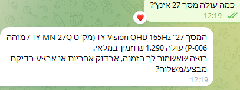

# Telegram Bots

The project uses **two separate bots**. Telegram lets only one webhook listen to a bot, so if both workflows point at the same bot token, whichever was activated last takes over and the other one goes silent (or answers in the wrong voice).

| Bot | n8n credential | Used by | Purpose |
|-----|----------------|---------|---------|
| Owner bot | Telegram account 6 | WF9 | Manager agent — invoices, receipts, tasks, policy/tax questions, creating documents. Owner's chat ID only. |
| Customer bot (`GuyCGCustomerServiceBot`) | Telegram account 4 | WF5 | Customer service — RAG over policies and products. |

## The customer bot in action

A policy question — the agent calls `search_policies` and answers from the returns policy (WF6 corpus):

A product question — the agent calls `search_products` and answers with the product's SKU, price and stock status from Airtable (WF7):

## Create both bots

1. Open a chat with **@BotFather** on Telegram.
2. `/newbot` → give it a name and a unique username → save the API token it returns.
3. Repeat for the second bot.
4. In n8n: Credentials → Add credential → Telegram API, once per bot. Name them clearly so they don't get confused later.
5. In each workflow, the Telegram **Trigger and every Telegram send node must use the same credential**. If the trigger listens on one bot and the reply node sends through another, the answer shows up in the other bot's chat.

To check which bot a credential really is: run the workflow once and open the send node's output in **Executions** — `result.from.username` is the bot that sent the message.

## Restricting WF9 to the owner

Message the owner bot once, then check WF9's **Executions** — the trigger payload includes `message.chat.id`. Put that number in the right-hand value of the **`Is Owner?`** IF node. The left side is `String($json.message.chat.id)` because Telegram sends the ID as a number and the IF node compares strings strictly. Anyone else gets the `Deny` reply.

## Tool names must be Latin

The AI Agent builds each tool's name from its node name and drops non-Latin characters. Two tools named only in Hebrew both become `_` and the agent refuses to run ("multiple tools with the same name"). That's why WF5's tools are `search_policies` / `search_products` and WF9's are `search_tasks`, `create_task`, etc.
