# 4. The workflows

All workflows live in the **My project** team project on n8n Cloud and use the Airtable base **AI-ERP** (9 tables, see [`schema/schema.json`](../schema/schema.json)). Numbering follows the course brief; WF2, WF10, WF11 and WF12 (reports, reminders, schema validation, product sync) were dropped to keep the build lean. Every workflow opens with a sticky note (`הסבר`) that says what it does and what it needs.

| # | Name | Trigger | Flow |
|---|------|---------|------|
| WF1 | Tax Doc Validation | 3 Airtable Triggers — new Invoice / TaxInvoice / Receipt | `Read Document` → `Validate` (Edit Fields: builds the list of errors) → `Is Valid?` (no errors) → **true:** `Add To File Queue` (Files, Status=Pending) → `Run File Pipeline` (starts WF8 right away) · **false:** `Mark Invalid` (Status=Invalid + ValidationError) |
| WF3 | Contact Intake | Airtable Trigger — new Lead | `Normalize` → `Find Same Email` (Airtable formula: the same email on a lead created earlier) → `Duplicate?` → **true:** `Mark Dead` · **false:** `Keep As New` |
| WF4a | Sales Cold Emails | Every 3 hours | `Search New Leads` (Status=New and has an email, 1 per run) → `Write Cold Email` (LLM chain) → `Build HTML Email` (HTML node) → `Send Email` (Gmail, HTML) → `Mark Contacted` (+ GmailThreadId) |
| WF4b | Sales Reply Check | Gmail Trigger — subject "AI Electronics", every minute | `Extract Fields` → `Find Lead By Thread` (GmailThreadId) → `Is A Lead?` (a lead's thread, and received after our last email to them) → `Draft Reply` (AI Agent) → `Build HTML Email` (HTML node) → `Gmail Reply` (HTML) → `Mark Replied` |
| WF5 | Customer Service | Telegram (customer bot) | `סוכן שירות` (AI Agent + Simple Memory) with two *Answer questions with a vector store* tools: `search_policies` (key `policies`) and `search_products` (key `products`) → reply in Telegram |
| WF6 | Policies Embedding | Manual | `Manual Trigger` → `עריכת שדות` (the full policy text, 12 topics) → `Simple Vector Store` (insert, key `policies`) with `Embeddings` + `Load Documents` + `Text Splitter` (1000/150) |
| WF7 | Products Embedding | Manual | `All Products` (Airtable) → `Build Text` (Edit Fields) → `Simple Vector Store` (insert, key `products`) with `Embeddings` + `Default Data Loader` + `Text Splitter` (800/100) |
| WF8 | File Pipeline | Called by WF1 (+ hourly safety net) | `Pending Files` → `Get Source Record` → `Build HTML` (HTML node, Hebrew RTL) → `Prepare File` (Edit Fields: base64 + file name) → `Convert to File` (text/html) → `Google Drive Upload` → `Mark Done` (+ DriveLink) → `Save Link On Document` (PdfUrl on the invoice/tax invoice/receipt) |
| WF9 | Manager Agent | Telegram (owner bot) | `Is Owner?` → `Manager Agent` (Chat Memory; tools: policies vector store, `search_tasks`, `create_task`, `search_invoices_tax_receipt`, `Create_Invoice`, `Create_Tax_Invoice`, `Create_Receipt`) → `Send Answer` · not owner → `Deny` |
| WF13 | App Gateway | Webhook `POST /app-gateway` | For the admin app: `list` → read a table → one Edit Fields node per table (the app's row format) → Aggregate → `{records}` · `create` → next running number → one Edit Fields node per table (+ VAT for invoices) → Airtable create · `chat` → RAG agent · anything else → HTTP 400 |

## No Code nodes

The course brief asks for a no-code build, so no workflow uses a Code node. Logic is done with regular nodes: **Edit Fields (Set)** with expressions for mapping and calculations, **IF / Switch** for branching, **Aggregate** to turn many records into one list, the **HTML** node for the email and document templates, and **Airtable formulas** for lookups (for example WF3's "same email on an older lead").

## Create the credentials first

In n8n → **Credentials → Add credential**, one per service (six connections, as in the brief). Every node below picks one of these:

| Type | Name in this project | Used by | Setup |
|------|------|---------|-------|
| Airtable (OAuth2) | Airtable account 3 | Every Airtable node and tool | [docs/01](01-airtable.md) |
| OpenAI | OpenAI account 6 | All chat models (`gpt-5-mini`) and embeddings (`text-embedding-3-small`) | an OpenAI API key |
| Telegram | Telegram account 6 (owner bot) | WF9 — the trigger *and* both send nodes must use the same bot | [docs/02](02-telegram-bots.md) |
| Telegram | Telegram account 4 (customer bot) | WF5 | [docs/02](02-telegram-bots.md) |
| Gmail (OAuth2) | Gmail account 2 | WF4a, WF4b — must be the same mailbox | [docs/03](03-google-oauth.md) |
| Google Drive (OAuth2) | Google Drive account | WF8 | [docs/03](03-google-oauth.md) |

## Wiring each workflow

1. **Create the workflow** in n8n (build it from the tables below, or paste a workflow you exported from another instance — Create Workflow → click the canvas → paste).
2. **Airtable nodes** — pick your base from the list, then pick the table again (the base id changes between bases).
3. **Credentials** — open every node with a warning and pick the matching credential from the table above.
4. **Owner check (WF9)** — put your own Telegram chat id in `Is Owner?` ([docs/02](02-telegram-bots.md) shows how to find it).
5. **Publish** the ones that run on their own. WF6 and WF7 stay manual: you **Execute** them by hand.

## Run them in this order

| Order | Workflow | Why |
|---|---|---|
| 1 | **WF6 — Policies Embedding** (manual) | fills the `policies` vector store |
| 2 | **WF7 — Products Embedding** (manual) | fills the `products` vector store |
| 3 | **WF5, WF9, WF13** (publish) | the agents — they search the stores above |
| 4 | **WF1, WF3, WF4a, WF4b, WF8** (publish) | the automations |

⚠️ **Re-run WF6 and WF7 after every n8n restart.** The Simple Vector Store lives in memory: after a restart both stores are empty and the agents answer "I don't know". The agents' chat memory resets too.

## Which workflows need what

| Workflow | Credentials | Also needs |
|---|---|---|
| WF1 Tax Doc Validation | Airtable | a `Created` (Created time) field in Invoices, TaxInvoices, Receipts |
| WF3 Contact Intake | Airtable | a `Created` field in Leads |
| WF4a Sales Cold Emails | Airtable, Gmail, OpenAI | leads with `Status = New` and an email. ⚠️ sends real email — see [docs/03](03-google-oauth.md) |
| WF4b Sales Reply Check | Gmail, Airtable, OpenAI | the same mailbox as WF4a; the lead's `GmailThreadId` |
| WF5 Customer Service | Telegram (customer), OpenAI | WF6 + WF7 run first |
| WF6 Policies Embedding | OpenAI | nothing — the policy text is inside the workflow |
| WF7 Products Embedding | Airtable, OpenAI | products in Airtable |
| WF8 File Pipeline | Airtable, Google Drive | `Files` rows with `Status = Pending` (written by WF1) |
| WF9 Manager Agent | Telegram (owner), OpenAI, Airtable | your chat id in `Is Owner?`; WF6 run first |
| WF13 App Gateway | Airtable, OpenAI | WF6 + WF7 for the chat; the production URL stored in the app ([docs/05](05-app.md)) |

---

## The workflows one by one

Diagram colors: 🟩 trigger · 🟧 logic (Edit Fields, IF, Switch, Aggregate, HTML) · 🟦 action on a service (Airtable, Gmail, Drive, Telegram, webhook response) · 🟪 AI (agent, model, vector store).

### WF1 — Tax Doc Validation

Three Airtable triggers (one per document table) feed `Read Document`, which flattens the document into one item, and `Validate`, which builds the list of problems. A valid document is queued for WF8 and WF8 is started right away; an invalid one is marked with the reason.

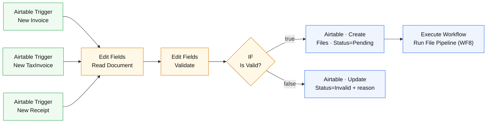

| Step | Node | What happens |
|---|---|---|
| 1 | `New Invoice` · `New TaxInvoice` · `New Receipt` | Airtable Triggers, every minute, on the `Created` field |
| 2 | `Read Document` | Edit Fields: `docType` from the trigger that fired (`$prevNode`), DocNumber, customer, dates and amounts as numbers, the **expected VAT rate** (0.18 from 2025-01-01, else 0.17), year and month for the Files row |
| 3 | `Validate` | Edit Fields: `validationError` = every failed check joined with `;` — DocNumber > 0 · a customer · IssueDate · Amount > 0 (receipts) / Subtotal > 0 · VATRate = expected rate · VATAmount = Subtotal × rate · Total = Subtotal + VAT · business number on tax invoices |
| 4 | `Is Valid?` | IF `validationError` is empty |
| 5a | `Add To File Queue` | Files: `FileId = Invoice-1003`, DocType, SourceRecordId, `Status = Pending`, Year, Month |
| 6a | `Run File Pipeline` | Execute Workflow → WF8, without waiting |
| 5b | `Mark Invalid` | the source record: `Status = Invalid`, `ValidationError` = the reason (e.g. `VATRate צריך להיות 0.18`) |

A successful run (one trigger fired; the `Mark Invalid` branch did not run):

### WF3 — Contact Intake

A new lead's email is normalized and looked up among **older** leads. If one exists, the new lead is a duplicate and is closed; otherwise it stays `New` for WF4a.

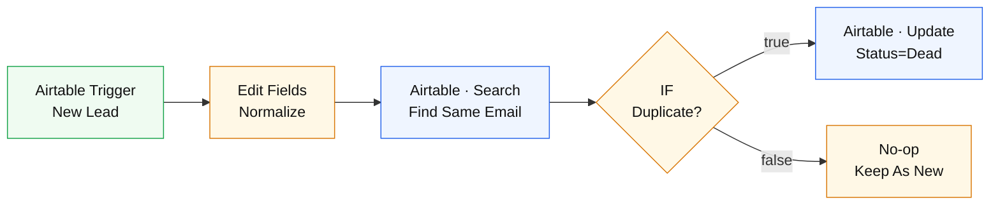

| Step | Node | What happens |
|---|---|---|
| 1 | `New Lead` | Airtable Trigger on Leads, every minute |
| 2 | `Normalize` | Edit Fields: record id, email trimmed + lower-case, name, created time |
| 3 | `Find Same Email` | Airtable search, limit 1: `AND(LOWER(TRIM({Email})) = email, RECORD_ID() != this lead, IS_BEFORE(CREATED_TIME(), this lead's created time))` — the whole duplicate check is one Airtable formula |
| 4 | `Duplicate?` | IF the search returned a record |
| 5a | `Mark Dead` | `Status = Dead`, Notes = "Duplicate email - auto-closed by WF3" |
| 5b | `Keep As New` | nothing to do — WF4a will pick the lead up |

A successful run (LEAD-0006, a new email, so it stays `New`):

### WF4a — Sales Cold Emails

Every 3 hours: take one `New` lead, have the LLM write a personal Hebrew email, wrap it in the HTML template, send it from Gmail, and store the Gmail thread id on the lead. One lead per run, so a mistake can't send dozens of emails.

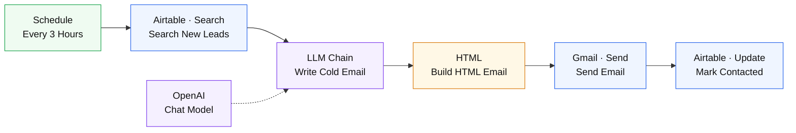

| Step | Node | What happens |
|---|---|---|
| 1 | `Every 3 Hours` | Schedule Trigger |
| 2 | `Search New Leads` | `AND({Status} = 'New', {Email} != '')`, **limit 1** |
| 3 | `Write Cold Email` | Basic LLM Chain + `Chat Model` (gpt-5-mini): a short Hebrew email with one call to action, no invented prices, signed "בברכה, צוות איי.איי אלקטרוניקה" |
| 4 | `Build HTML Email` | HTML node: the branded RTL template (table layout, inline styles); an expression turns the text into paragraphs |
| 5 | `Send Email` | Gmail, HTML, to the lead's email, subject "הצעה מיוחדת מ-AI Electronics" |
| 6 | `Mark Contacted` | `Status = Contacted`, `GmailThreadId`, `LastContactedAt` |

A successful run (the email to LEAD-0006):

### WF4b — Sales Reply Check

New Gmail messages are matched to a lead by thread id. If it is a lead's reply, the agent drafts an answer, replies in the same thread, and marks the lead `Replied`.

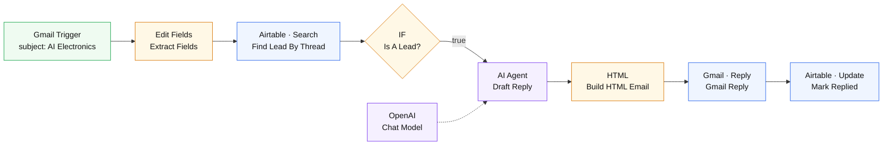

| Step | Node | What happens |
|---|---|---|
| 1 | `Gmail Trigger` | polls every minute: `in:inbox subject:"AI Electronics"` |
| 2 | `Extract Fields` | Edit Fields: message id, thread id, sender (`extractEmail()`), subject, snippet, message time |
| 3 | `Find Lead By Thread` | `{GmailThreadId} = thread id`, limit 1 |
| 4 | `Is A Lead?` | a lead was found **and** the message arrived after `LastContactedAt` — so our own sent copies are never answered |
| 5 | `Draft Reply` | AI Agent (gpt-5-mini): a warm Hebrew follow-up, one next step, no prices or discounts, signed by the team |
| 6 | `Build HTML Email` | the same HTML template as WF4a |
| 7 | `Gmail Reply` | reply in the same thread, to the sender only |
| 8 | `Mark Replied` | `Status = Replied`, `LastContactedAt = now` |

A successful run (שירה גולן answered the cold email; WF4b replied about a minute later):

An earlier reply thread, as the lead sees it in Gmail:

### WF5 — Customer Service

Telegram customer bot → service agent with memory and two RAG tools. The system prompt lists the store's categories, tells the agent to answer only from what the tools return, and to offer the closest alternative when a product isn't sold.

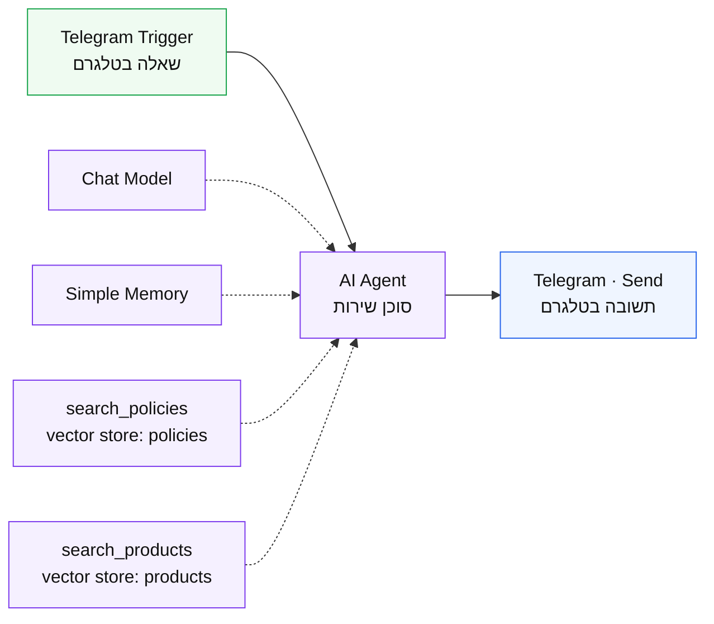

| Step | Node | What happens |
|---|---|---|
| 1 | `שאלה בטלגרם` | Telegram Trigger (customer bot) |
| 2 | `סוכן שירות` | AI Agent (gpt-5-mini) + `Simple Memory` per chat |
| — | `search_policies` | Answer questions with a vector store → Simple Vector Store, key `policies` |
| — | `search_products` | Answer questions with a vector store → Simple Vector Store, key `products`, top 8 |
| 3 | `תשובה בטלגרם` | sends the answer back to the same chat |

A successful run: the headphones question below. The agent only needed `search_products`, so the policies branch has no check:

### WF6 — Policies Embedding

As the course brief asks, the policy text lives inside the workflow: the `עריכת שדות` (Edit Fields) node holds the 12 policy topics as separate text fields (returns, warranty, shipping, prices, payments, tax rules, agent guardrails, tone, sales playbook, manager brief, business overview, FAQ). **Execute workflow** chunks and embeds them into the in-memory store under the key `policies`. To change a policy: edit its text box and run WF6 again. (The same text is kept in [`mock/policies/`](../mock/policies/) as a readable copy.)

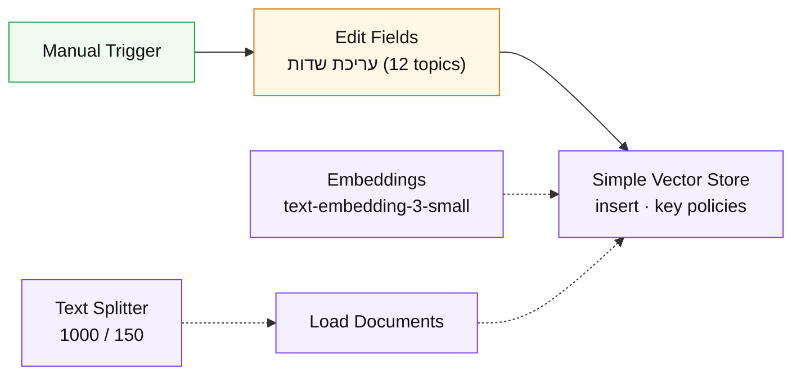

A successful run (62 chunks):

### WF7 — Products Embedding

Read every product from Airtable → one Hebrew text per product → embed under the key `products`.

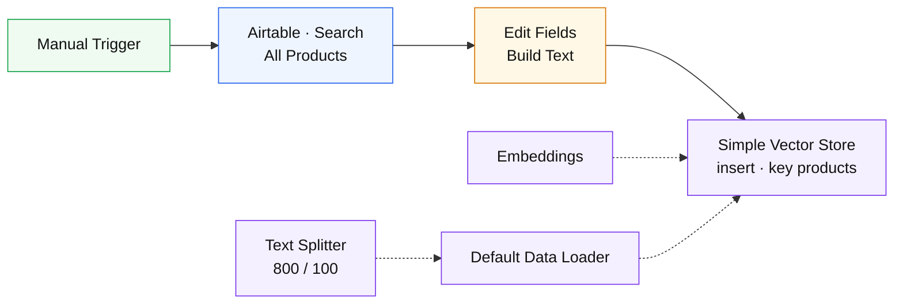

| Step | Node | What happens |
|---|---|---|
| 1 | `All Products` | all 34 products |
| 2 | `Build Text` | Edit Fields: `מוצר / מקט / קטגוריה / מותג / מחיר / סטטוס / במלאי / אחריות / תיאור` as one text, plus `productId` and `name` as metadata |
| 3 | `Simple Vector Store` | insert with `clearStore`, key `products` |

A successful run (34 products):

### WF8 — File Pipeline

Started by WF1 as soon as a valid document is queued (an hourly schedule catches anything left over).

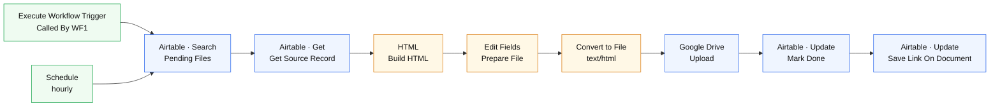

| Step | Node | What happens |
|---|---|---|
| 1 | `Called By WF1` / `Schedule Trigger` | WF1 starts it at once; the hourly run is a safety net |
| 2 | `Pending Files` | `{Status} = 'Pending'` in Files (runs once) |
| 3 | `Get Source Record` | the invoice / tax invoice / receipt the row points to (`DocType` picks the table) |
| 4 | `Build HTML` | HTML node: the Hebrew RTL document — title by type, number, date, customer, business number (tax invoices), line items, and the amounts table (receipts show amount paid / payment method / related invoice instead). A readable copy is in [`templates/`](../templates/) |
| 5 | `Prepare File` | Edit Fields: the HTML as base64 (`base64Encode()`), the file name (`Invoice-1003.html`), the Files row id |
| 6 | `Convert to File` | base64 → binary with **`text/html`** (text mode would store it as text/plain) |
| 7 | `Google Drive Upload` | uploads to My Drive |
| 8 | `Mark Done` | Files row: `Status = Done`, `DriveFileId`, `DriveLink` |
| 9 | `Save Link On Document` | writes the Drive link into the document's `PdfUrl` — the app's "מסמך" link |

A successful run (INV-1003):

**How WF8 gets a document without a renderer.** The course brief rules out an external conversion service, so the document is stored as HTML in Drive:

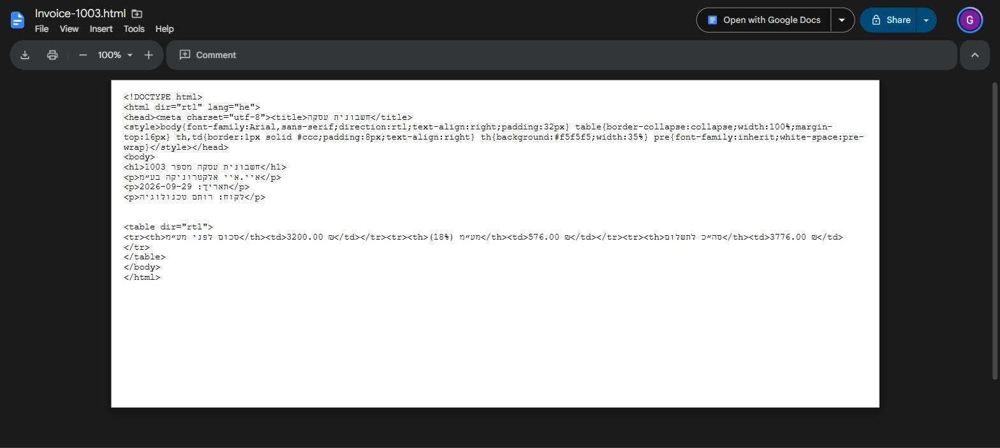

Opened in a browser (or in Google Docs: right-click → Open with Google Docs → File → Download → PDF) it renders like this:

### WF9 — Manager Agent

Owner-only Telegram bot. The agent has memory, the policies knowledge base, and Airtable tools to search/create tasks, search documents, and create invoices, tax invoices and receipts — only after the owner confirms with an explicit "כן".

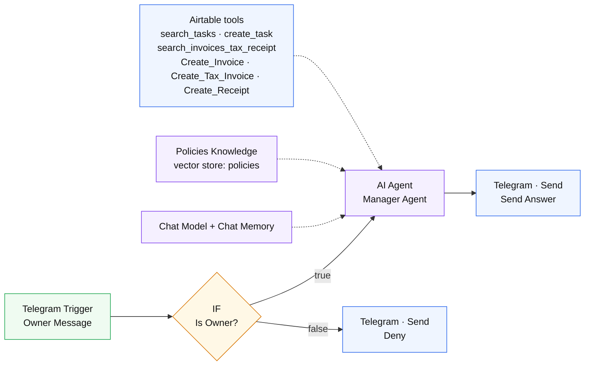

| Step | Node | What happens |
|---|---|---|
| 1 | `Owner Message` | Telegram Trigger (owner bot) |
| 2 | `Is Owner?` | IF the chat id equals the owner's |
| 3 | `Manager Agent` | AI Agent (gpt-5-mini) + `Chat Memory` (last 10 messages). System prompt: answer in Hebrew, compute revenue only from `search_invoices_tax_receipt` results, never invent numbers, confirm before creating a document |
| — | `Answer questions with a vector store` | policies and Israeli tax rules (key `policies`) |
| — | `search_tasks` / `create_task` | Airtable tools on Tasks |
| — | `search_invoices_tax_receipt` | Airtable tool on Invoices / TaxInvoices / Receipts, the agent picks the table and the formula |
| — | `Create_Invoice` / `Create_Tax_Invoice` / `Create_Receipt` | Airtable tools; WF1 then validates the new document and WF8 renders it |
| 4 | `Send Answer` / `Deny` | the answer, or "הבוט הזה מיועד לבעל העסק בלבד" |

A successful run (the agent used `search_invoices_tax_receipt`; tools it did not need and the `Deny` branch stay grey):

The conversation from that run ("מה ההכנסות?"):

### WF13 — App Gateway

The only entry point for the admin app, so the app holds no Airtable key. The request body is `{ action, table, payload }` or `{ action: "chat", message }` — the full contract is in [docs/05](05-app.md).

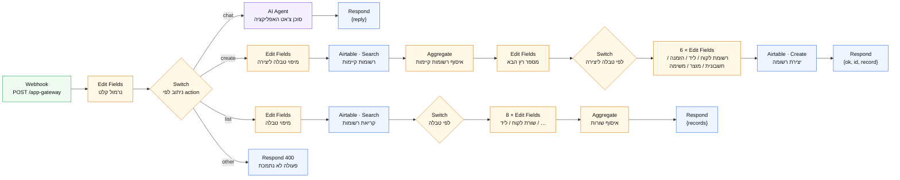

**list** (`{ action: "list", table }`)

| Step | Node | What happens |
|---|---|---|
| 1 | `מיפוי טבלה` | Edit Fields: the app's table name (`invoices`, `leads`, …) → Airtable table id |
| 2 | `טבלה קיימת?` | IF there is such a table — else `תגובה ריקה` returns `{ records: [] }` |
| 3 | `קריאת רשומות` | Airtable search, all records (retries on the 5-requests-per-second limit) |
| 4 | `יש רשומות?` | an empty table goes to `תגובה ריקה` |
| 5 | `לפי טבלה` | Switch: customers · leads · orders · products · invoices + taxinvoices · receipts · tasks · files |
| 6 | `שורת לקוח` … `שורת קובץ` | one Edit Fields node per table: lowercase keys, Hebrew status labels (`Issued → פתוחה`, `Paid → שולמה`, `New → חדש`…), dates as dd/mm/yyyy, `doc` = the Drive link |
| 7 | `איסוף שורות` → `תגובת רשימה` | Aggregate all rows into `records` → `{ records: [...] }` |

**create** (`{ action: "create", table, payload }`)

| Step | Node | What happens |
|---|---|---|
| 1 | `מיפוי טבלה ליצירה` | table id, the id field (`CustomerId`, `LeadId`, …, `DocNumber` for invoices) and the first number (1 / 1001) — only customers, leads, orders, invoices, products and tasks can be created |
| 2 | `רשומות קיימות` → `איסוף רשומות קיימות` | read the table once and aggregate it into one list |
| 3 | `מספר רץ הבא` | Edit Fields: the highest number in the id field + 1 |
| 4 | `לפי טבלה ליצירה` → `רשומת …` | one Edit Fields node per table turns the form into an Airtable record: `CUST-0002`, `LEAD-0006`, `ORD-0002`, `P-035`, `TASK-0002`, invoices `INV-1003` + `DocNumber`; Hebrew labels → Airtable values. This is a demo, so a new lead always gets a `+leadN` alias of the project mailbox (e.g. `guycgai+lead6@gmail.com`) and WF4a's email really arrives |
| 5 | `חישוב מע״מ` | invoices only: `VATRate` 0.18 (0.17 before 2025-01-01), `VATAmount` and `Total` rounded to agorot |
| 6 | `יצירת רשומה` → `תגובת יצירה` | Airtable create (typecast) → `{ ok, success, id, record }`. The new document then goes through WF1 and WF8 like any other |

**chat** (`{ action: "chat", message }`) goes to `סוכן צ'אט האפליקציה`, a RAG agent with the same `search_policies` / `search_products` tools as WF5, and returns `{ reply }`. Anything else returns HTTP 400.

Successful runs: `create` of INV-1003 from the app webhook (top) and `list` for the invoices screen (bottom):

---

## How the pieces connect

- A document created anywhere (Airtable UI, the app via WF13, or the manager bot via WF9) is picked up by **WF1**, validated, queued in **Files**, and handed straight to **WF8**, which renders it to Google Drive and writes the link back to the document (`PdfUrl`).
- A lead created anywhere is de-duplicated by **WF3** → emailed by **WF4a** (which stores the Gmail thread) → replies are answered by **WF4b**.
- **WF6/WF7** fill the in-memory vector store that **WF5**, **WF9** and **WF13** read from.

## Design choices

- **Models:** OpenAI — `gpt-5-mini` for the agents and emails, `text-embedding-3-small` for the vector stores.
- **WF8** has no HTML→PDF step. The course brief rules out an external conversion service, so the document stays HTML on Drive (manual PDF: open in Google Docs → Download → PDF).
- **WF8** has a `Get Source Record` node — the Files queue row only stores a pointer, so the HTML step needs the actual document data.
- **WF6** keeps the policy text inside the workflow, as the course brief asks, instead of reading it from files.
- **WF9**'s document search tool is named `search_invoices_tax_receipt` (no slashes, so it's a valid tool name).
- **WF5**'s tools are named in English (`search_policies`, `search_products`): n8n builds the tool name from the node name and strips non-Latin letters, so two Hebrew-named tools both became `_` and collided.
- **WF13** serves the admin app (section 8 of the brief).

## Keeping the workflows

The **live n8n instance is the source of truth** — this repo keeps no workflow exports. Exports carry node parameters (the owner's Telegram chat id, the webhook path, the base id), so they stay out of git. To back a workflow up: open it → ⋯ → **Download**, and keep the file private.
