# n8n Workflows

All workflows live in the **My project** team project on n8n Cloud and use the Airtable base **AI-ERP** (9 tables, see [`schema/schema.json`](../schema/schema.json)). Numbering follows the course brief; WF2, WF10, WF11 and WF12 (reports, reminders, schema validation, product sync) were dropped to keep the build lean.

| # | Name | Trigger | Flow |
|---|------|---------|------|
| WF1 | Tax Doc Validation | 3 Airtable Triggers — new Invoice / TaxInvoice / Receipt | `Validate` (Code) → `Is Valid?` → **true:** `Add To File Queue` (Files, Status=Pending) → `Run File Pipeline` (starts WF8 right away) · **false:** `Mark Invalid` (Status=Invalid + ValidationError) |
| WF3 | Contact Intake | Airtable Trigger — new Lead | `Normalize` → `Find Same Email` → `Count Matches` → `Duplicate?` → **true:** `Mark Dead` · **false:** `Keep As New` |
| WF4a | Sales Cold Emails | Every 3 hours | `Search New Leads` (Status=New and has an email, 1 per run) → `Write Cold Email` (LLM chain) → `Build HTML Email` → `Send Email` (Gmail, HTML) → `Mark Contacted` (+ GmailThreadId) |
| WF4b | Sales Reply Check | Gmail Trigger — subject "AI Electronics", every minute | `Extract Fields` → `Find Lead By Thread` (GmailThreadId) → `Is A Lead?` (a lead's thread, and received after our last email to them) → `Draft Reply` (AI Agent) → `Build HTML Email` → `Gmail Reply` (HTML) → `Mark Replied` |
| WF5 | Customer Service | Telegram (customer bot) | `סוכן שירות` (AI Agent + Simple Memory) with two *Answer questions with a vector store* tools: `search_policies` (key `policies`) and `search_products` (key `products`) → reply in Telegram |
| WF6 | Policies Embedding | Manual | `Manual Trigger` → `עריכת שדות` (the full policy text, 12 topics) → `Simple Vector Store` (insert, key `policies`) with `Embeddings` + `Load Documents` + `Text Splitter` (1000/150) |
| WF7 | Products Embedding | Manual | `All Products` (Airtable) → `Build Text` → `Simple Vector Store` (insert, key `products`) with `Embeddings` + `Default Data Loader` + `Text Splitter` (800/100) |
| WF8 | File Pipeline | Called by WF1 (+ hourly safety net) | `Pending Files` → `Get Source Record` → `Build HTML` (Hebrew, RTL) → `Convert to File` (text/html) → `Google Drive Upload` → `Mark Done` (+ DriveLink) → `Save Link On Document` (PdfUrl on the invoice/tax invoice/receipt) |
| WF9 | Manager Agent | Telegram (owner bot) | `Is Owner?` → `Manager Agent` (Chat Memory; tools: policies vector store, `search_tasks`, `create_task`, `search_invoices_tax_receipt`, `Create_Invoice`, `Create_Tax_Invoice`, `Create_Receipt`) → `Send Answer` · not owner → `Deny` |
| WF13 | App Gateway | Webhook `POST /app-gateway` | For the admin app: `{action:"list", table}` → reads the table and returns `{records}` in the app's row format; `{action:"create", table, payload}` → turns the form into an Airtable record (running ID; invoices also get DocNumber, VAT and total) and writes it; `{action:"chat", message}` → RAG agent |

## Screenshots

### WF1 — Tax Doc Validation
Three Airtable triggers (one per document table) feed a single `Validate` Code node: required fields, VAT rate by issue date, VAT amount and total arithmetic, and a customer business number on tax invoices. Valid documents are queued for WF8; invalid ones are marked with the reason.

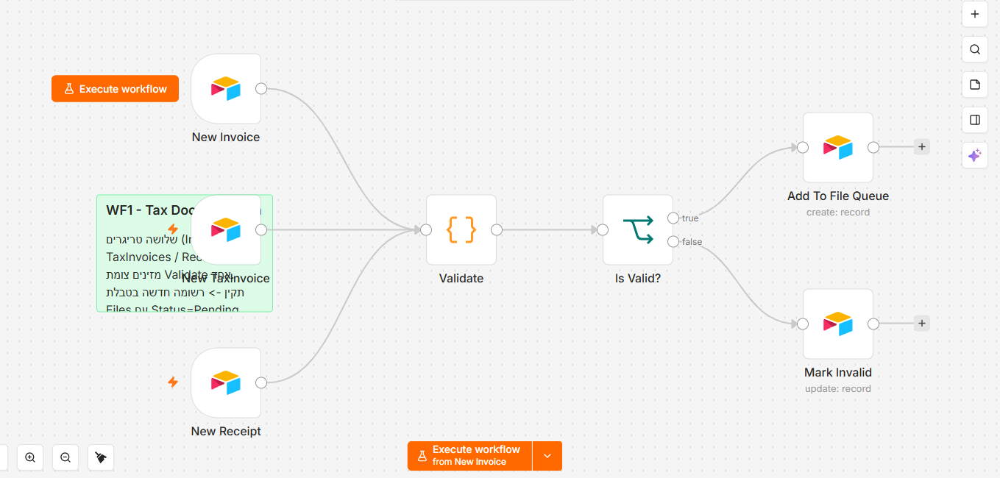

A successful run (one trigger fired; the `Mark Invalid` branch did not run):

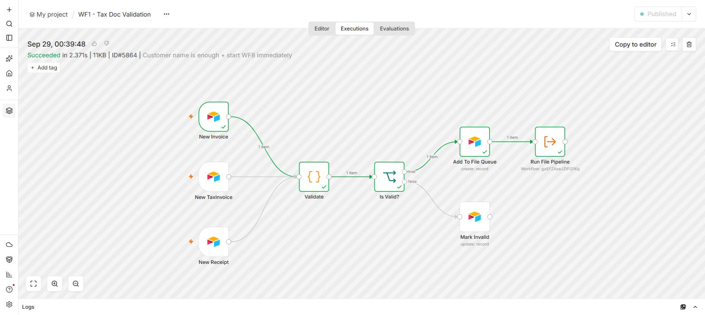

### WF3 — Contact Intake
A new lead's email is normalized (trimmed, lower-case), checked against existing leads with the same email, and marked `Dead` if another lead already has it.

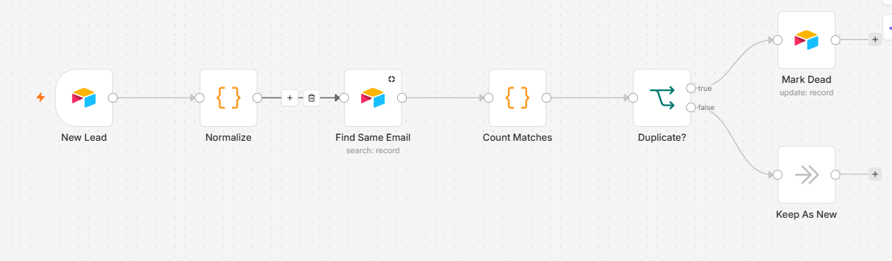

A successful run (a duplicate lead, so the `Mark Dead` branch ran):

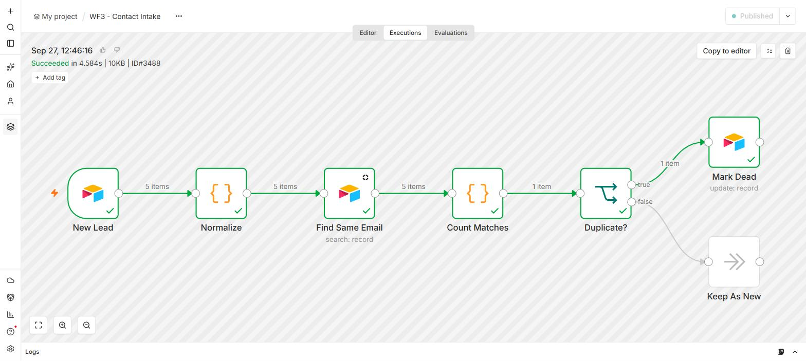

### WF4a — Sales Cold Emails
Every 3 hours: take one `New` lead, have the LLM write a personal Hebrew email, send it from Gmail, and store the Gmail thread ID on the lead.

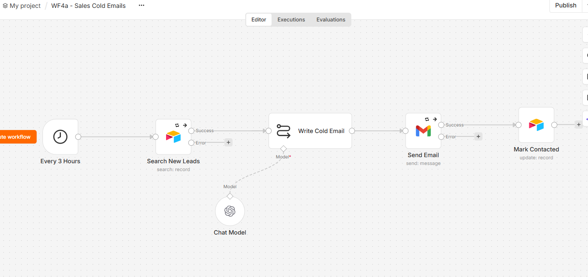

A successful run:

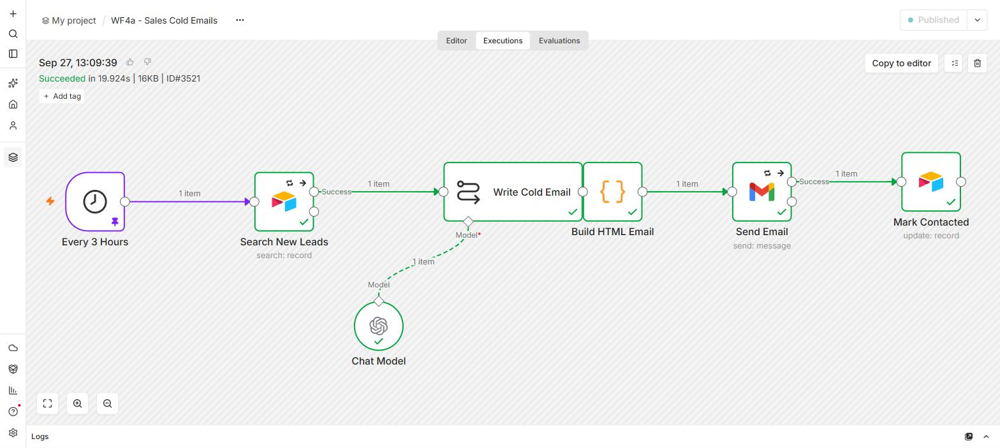

### WF4b — Sales Reply Check
New Gmail messages are matched to a lead by thread ID; if it's a lead's reply, the agent drafts an answer, replies in the same thread, and marks the lead `Replied`.

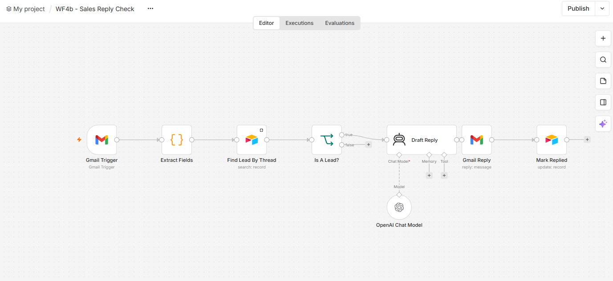

A successful run:

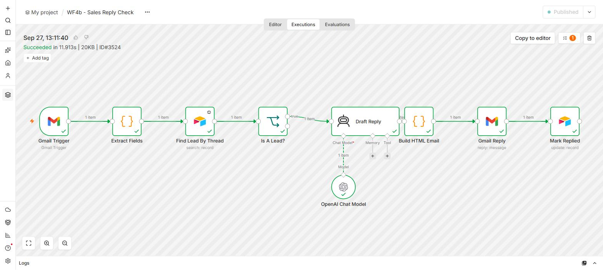

Both sales emails go through a `Build HTML Email` Code node that wraps the AI's text in a branded, right-to-left HTML template (table layout with inline styles, so it renders the same in Gmail, Outlook and on phones), signed "צוות איי.איי אלקטרוניקה". WF4b only answers messages on a lead's thread that arrived after our last email to that lead, so copies of our own emails are never answered.

**Example:** the lead replied to the cold email asking to set up a call; WF4b answered in the same thread within about a minute:

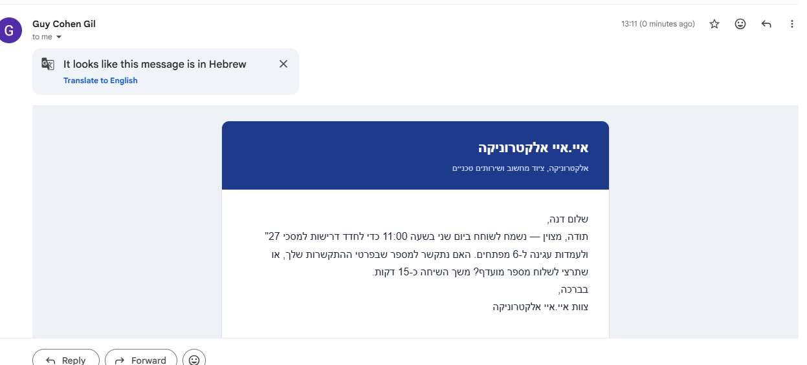

### WF5 — Customer Service
Telegram customer bot → service agent with memory and two RAG tools: `search_policies` and `search_products`.

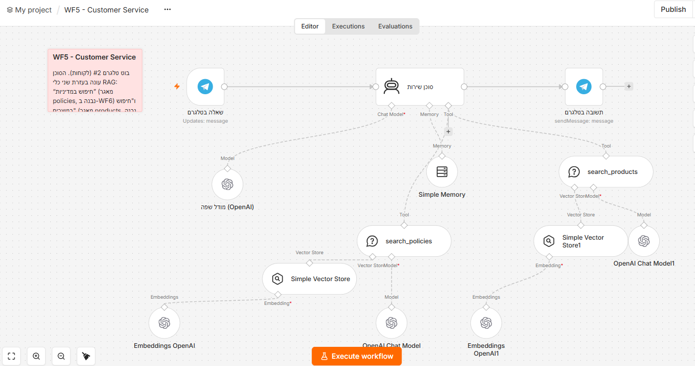

A successful run (only the tools the agent used in that conversation run, so the policies branch has no check):

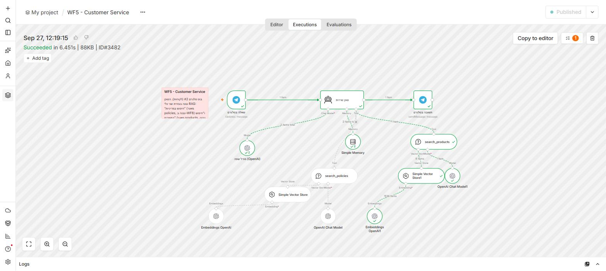

### WF6 — Policies Embedding
As the course brief asks, the policy text lives inside the workflow: the `עריכת שדות` (Edit Fields) node holds the 12 policy topics as separate text fields (returns, warranty, shipping, prices, payments, tax rules, agent guardrails, tone, sales playbook, manager brief, business overview, FAQ). **Execute workflow** chunks and embeds them into the in-memory store under the key `policies`. To change a policy: edit its text box and run WF6 again. (The same text is kept in [`mock/policies/`](../mock/policies/) as a readable copy.)

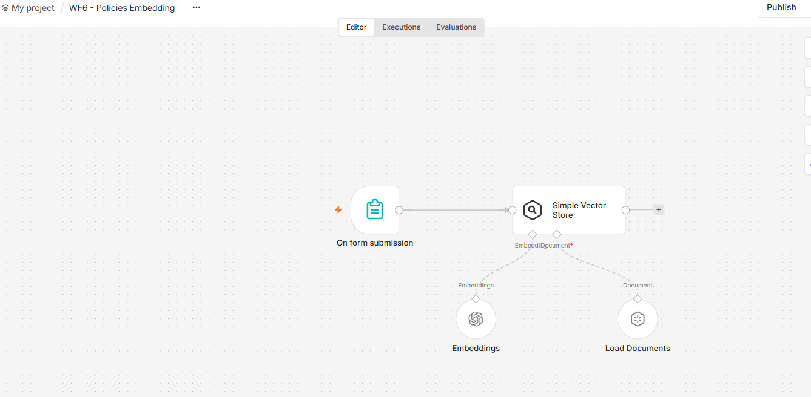

A successful run:

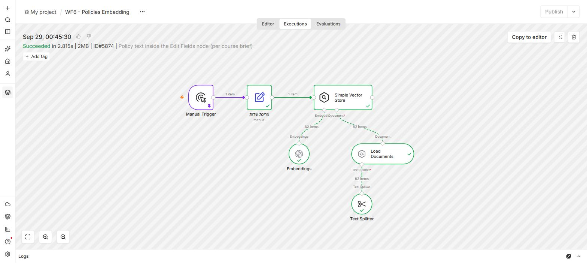

### WF7 — Products Embedding
Read every product from Airtable → build one Hebrew text per product → embed under the key `products`.

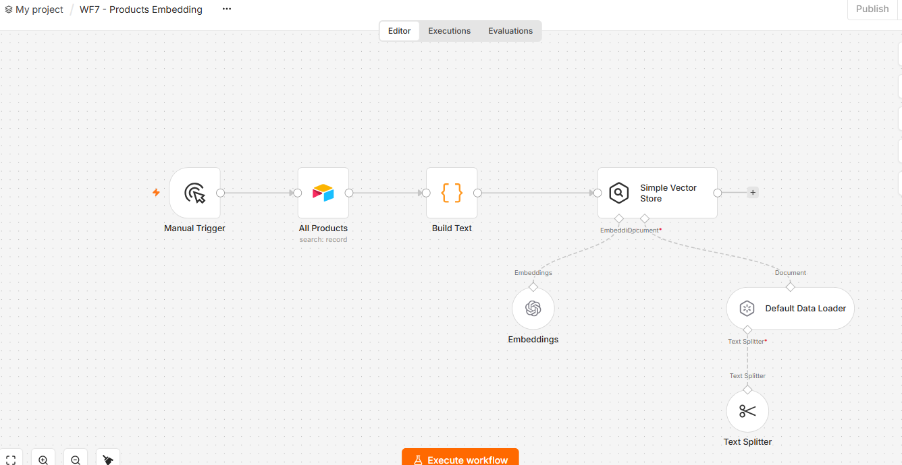

A successful run:

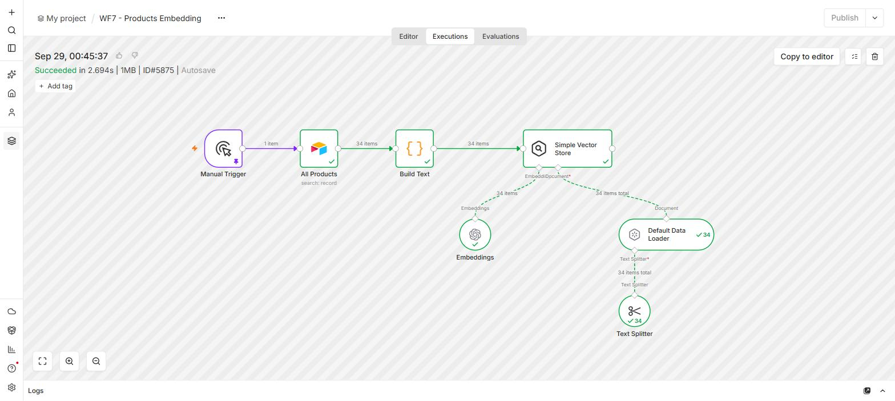

### WF8 — File Pipeline
Started by WF1 as soon as a valid document is queued (an hourly schedule catches anything left over): pending rows in `Files` → fetch the source document → Hebrew RTL HTML → Google Drive (as `text/html`) → mark `Done` and write the Drive link into the document's `PdfUrl`, which the app shows as the "מסמך" link.

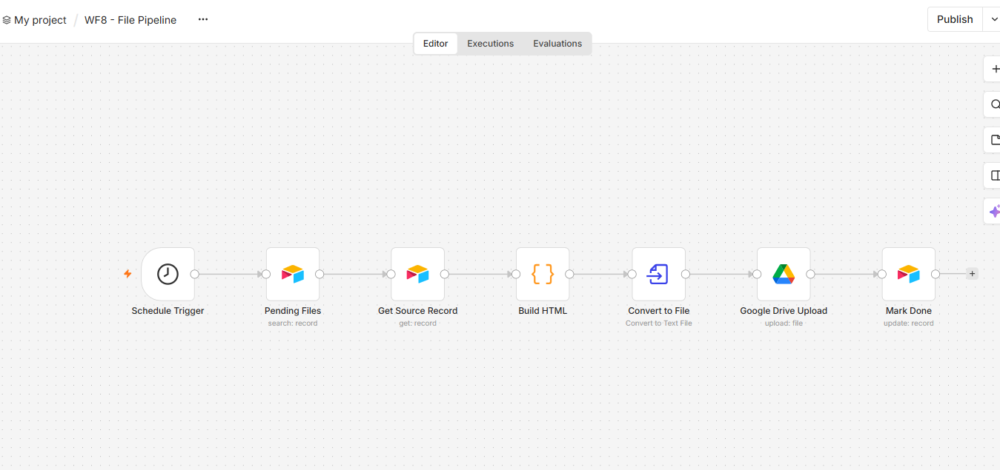

A successful run:

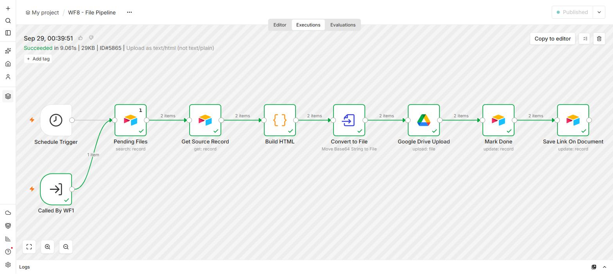

### WF9 — Manager Agent
Owner-only Telegram bot. The agent has memory, the policies knowledge base, and Airtable tools to search/create tasks, search documents, and create invoices, tax invoices and receipts (after the owner confirms).

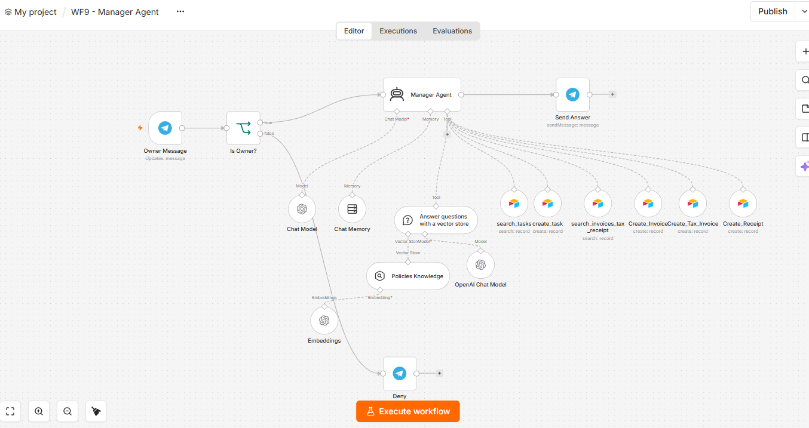

A successful run (the agent used `search_invoices_tax_receipt`; tools it did not need and the `Deny` branch stay grey):

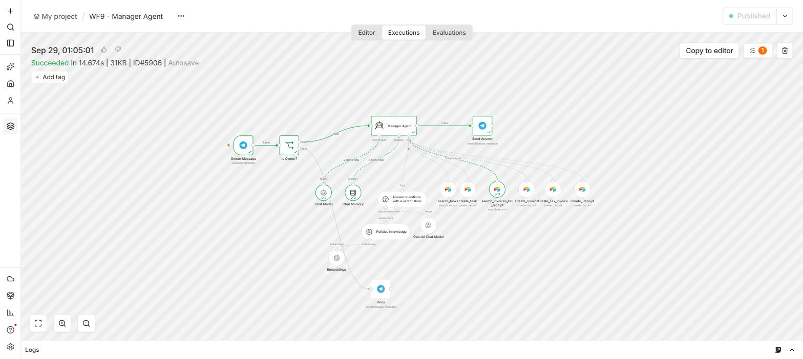

### WF13 — App Gateway
The only entry point for the admin app, so the app holds no Airtable key. `list` reads a table (customers, leads, orders, invoices, products, tasks) and converts it to the app's row format; `create` converts an app form (Hebrew labels → Airtable values, running IDs such as `CUST-0001` / `ORD-0001`, invoices with DocNumber + 18%/17% VAT + total) and writes it (this is a demo, so a new lead always gets a `+leadN` alias of the project mailbox, e.g. `guycgai+lead6@gmail.com`, and WF4a's email to it really arrives); `chat` goes to a RAG agent with the same `search_policies` / `search_products` tools as WF5; anything else returns an error. The Airtable read retries on the 5-requests-per-second limit.

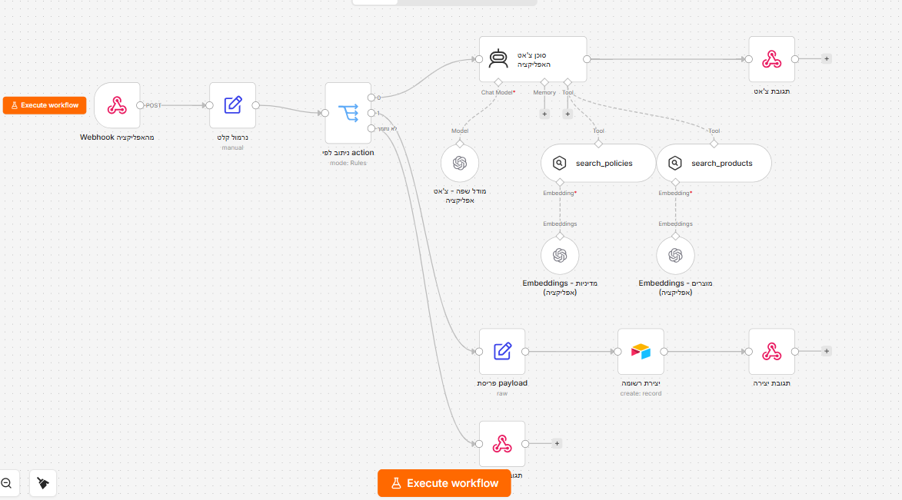

Successful runs: `create` from an app form (top) and `list` for a table screen (bottom):

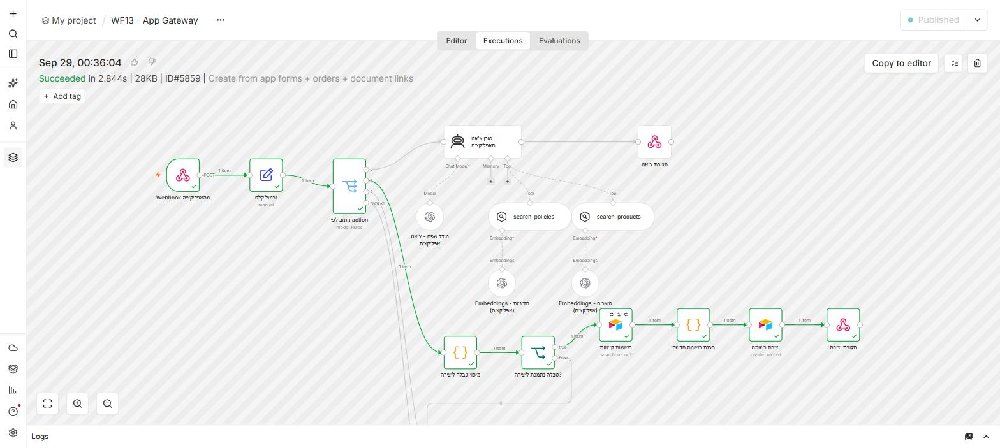

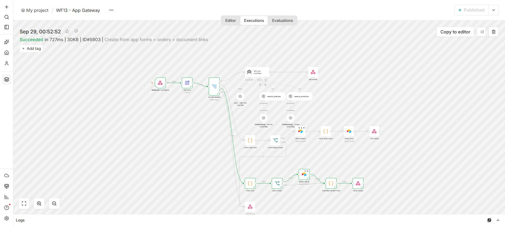

## How the pieces connect

- A document created anywhere (Airtable UI, the app via WF13, or the manager bot via WF9) is picked up by **WF1**, validated, queued in **Files**, and handed straight to **WF8**, which renders it to Google Drive and writes the link back to the document (`PdfUrl`).
- A lead created anywhere is de-duplicated by **WF3** → emailed by **WF4a** (which stores the Gmail thread) → replies are answered by **WF4b**.
- **WF6/WF7** fill the in-memory vector store that **WF5**, **WF9** and **WF13** read from.

## Differences from the reference structure

- **Models:** OpenAI (`gpt-5-mini`, `text-embedding-3-small`) instead of GLM / bge-m3.
- **WF8** has no HTML→PDF step. The course brief rules out an external conversion service, so the invoice stays HTML on Drive (manual PDF: open in Google Docs → Download → PDF).
- **WF8** has an extra `Get Source Record` node — the Files queue row only stores a pointer, so the HTML step needs the actual document data.
- **WF9**'s document search tool is named `search_invoices_tax_receipt` (no slashes, so it's a valid tool name).
- **WF5**'s tools are named in English (`search_policies`, `search_products`): n8n builds the tool name from the node name and strips non-Latin letters, so two Hebrew-named tools both became `_` and collided.

## The admin app (Lovable)

The app calls WF13 through a Lovable server function; the webhook address is a Lovable secret (`N8N_WEBHOOK_URL`), so nothing sensitive runs in the browser. The dashboard is computed from the same `list` responses as the tables:

## Credentials

| Type | Name | Used by |
|------|------|---------|
| Airtable (OAuth2) | Airtable account 3 | Every Airtable node and tool |
| OpenAI | OpenAI account 6 | All chat models and embeddings |
| Telegram | Telegram account 6 (owner bot) | WF9 — trigger *and* both send nodes must use the same bot credential |
| Telegram | Telegram account 4 (customer bot) | WF5 |
| Gmail (OAuth2) | Gmail account 2 | WF4a, WF4b — must be the same mailbox |
| Google Drive (OAuth2) | Google Drive account | WF8 |
