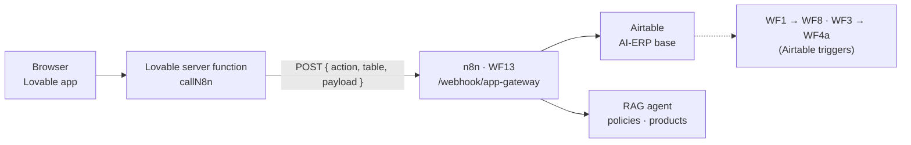
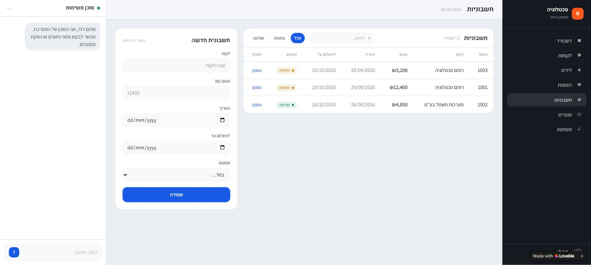
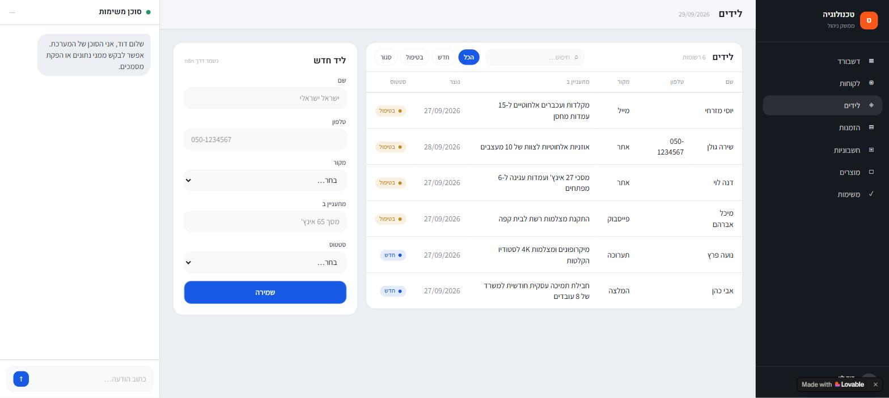
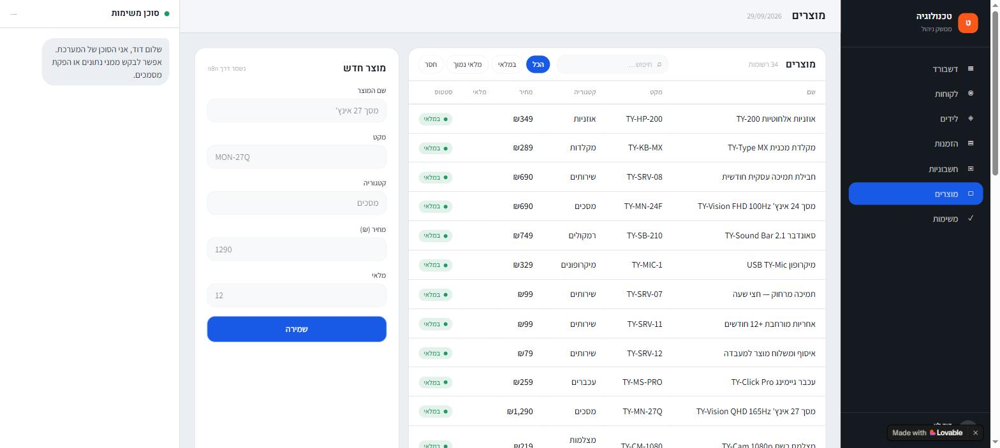
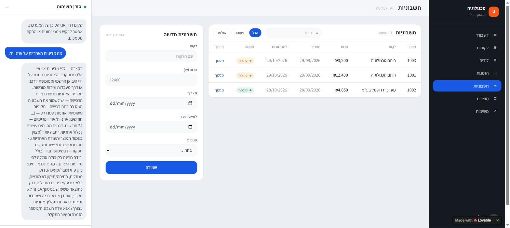

# 5. The admin app (Lovable)

The admin app is what the business owner opens in the morning: a dashboard, table screens, create forms, and a chat with the agent. It was built in **Lovable** by describing it in plain language — no backend code — and it talks to one address only: the WF13 webhook.

**Live app:** <https://guycohengilproject.lovable.app>


## How it connects



- The browser never calls n8n directly. A Lovable **server function** (`callN8n`) does, and it reads the webhook address from a Lovable **secret**, `N8N_WEBHOOK_URL`. Nothing sensitive runs in the browser.
- The app holds **no Airtable key at all** — WF13 holds the Airtable credential and enforces the rules in one place (the brief's recommended route for every write).
- A record written by the app is a normal Airtable record, so the Airtable triggers pick it up: a new invoice goes through **WF1 → WF8** (VAT check, document in Drive, link back in `PdfUrl`), a new lead through **WF3 → WF4a → WF4b**.

### Setting it up

1. In n8n, open **WF13** → the `Webhook מהאפליקציה` node → copy the **Production URL** (`https://<your-instance>.app.n8n.cloud/webhook/app-gateway`).
2. In Lovable: project **Settings → Secrets** → add `N8N_WEBHOOK_URL` with that URL.
3. Publish WF13 (the production URL only answers while the workflow is published).
4. Publish the app and check: the dashboard loads, a form creates a record in Airtable, and the chat answers.

## The build prompt

The app started from the course brief's prompt:

```text
Build an internal admin app for a small Israeli electronics business.
Hebrew UI, RTL layout, ILS currency, dd/mm/yyyy dates.
Screens: Dashboard, Customers, Leads, Orders, Invoices, Products, Tasks.
Data comes from a REST endpoint I will provide (n8n webhook) - do not
create your own database. All writes POST to the same webhook with a
JSON body: { action, table, payload }.
Add a chat panel that POSTs { action: "chat", message } and renders
the "reply" field from the response.
```

and was refined with short follow-ups, the way these platforms are used: call the webhook from a server function with the URL in the secret `N8N_WEBHOOK_URL`; read every screen with `{ action: "list", table }` and accept either an array or `{ records: [...] }`; show the invoice's `doc` field as a "מסמך" link; build the dashboard cards from the same list responses; add search and status filters to every table.

## The API contract (WF13)

Every request is a `POST` with a JSON body. Table names are the app's lowercase names.

### `list` — read a table

```json
{ "action": "list", "table": "invoices" }
```
```json
{ "records": [
  { "id": "1003", "customer": "רותם טכנולוגיה", "amount": 3200, "vat": 576, "total": 3776,
    "date": "29/09/2026", "due": "29/10/2026", "status": "פתוחה",
    "doc": "https://drive.google.com/file/d/…/view" }
] }
```

| `table` | Row fields |
|---|---|
| `customers` | `id, name, phone, email, city, status (פעיל / לא פעיל), total, doc` |
| `leads` | `id, name, company, phone, email, source (אתר / המלצה / מייל / תערוכה / פייסבוק / טלפון), interest, status (חדש / בטיפול / סגור), created` |
| `orders` | `id, customer, items, amount, date, status (בהמתנה / נשלח / הושלם / בוטלה), doc` |
| `invoices`, `taxinvoices` | `id (DocNumber), customer, amount (before VAT), vat, total, date, due, status (טיוטה / פתוחה / שולמה / בוטלה / לא תקינה), doc (Drive link)` |
| `receipts` | `id, customer, amount, date, status, doc` |
| `products` | `id, name, sku, price, stock, category, status (במלאי / חסר / הופסק), warranty, description` |
| `tasks` | `id, title, owner, due, status (פתוחה / להיום / הושלמה), priority (דחוף / רגיל)` |
| `files` | `id, type, status, doc` |

Dates are `dd/mm/yyyy`; amounts are numbers in ₪. An unknown or empty table returns `{ "records": [] }`.

### `create` — write a record

```json
{ "action": "create", "table": "invoices",
  "payload": { "customer": "רותם טכנולוגיה", "amount": "3200", "date": "2026-09-29", "due": "2026-10-29", "status": "פתוחה" } }
```
```json
{ "ok": true, "success": true, "id": "rec0q0WELPqJASsx2",
  "record": { "InvoiceId": "INV-1003", "DocNumber": 1003, "Subtotal": 3200, "VATRate": 0.18, "VATAmount": 576, "Total": 3776, "Status": "Issued", "…": "…" } }
```

| `table` | `payload` fields (all strings, as the forms send them) | WF13 adds |
|---|---|---|
| `customers` | `name, phone, email, city, notes` | `CustomerId` (`CUST-0002`), `Status = Active` |
| `leads` | `name, phone, company, interest, source, status` | `LeadId` (`LEAD-0006`), `Email` (`guycgai+lead6@gmail.com`, demo alias), Airtable source/status values |
| `orders` | `customer, items, amount, date, status` | `OrderId` (`ORD-0002`), date defaults to today |
| `invoices` | `customer, amount, date, due, status` | `InvoiceId` + `DocNumber` (1003), VAT 18% (17% before 2025), `VATAmount`, `Total` |
| `products` | `name, sku, category, price, stock` | `ProductId` (`P-035`), `Status` (`OutOfStock` when stock is 0) |
| `tasks` | `title, owner, due, status, priority` | `TaskId` (`TASK-0002`); status "להיום" without a date → due today |

### `chat` — ask the agent

```json
{ "action": "chat", "message": "מה מדיניות האחריות על אוזניות?" }
```
```json
{ "reply": "בקצרה — לפי מדיניות איי.איי אלקטרוניקה: האחריות ניתנת על ידי היבואן הרשמי…" }
```

Anything else returns HTTP 400 with `{ "success": false, "error": "פעולה לא נתמכת" }`.

## The screens

**Dashboard** (top of this page) — revenue this month (paid invoices), open invoices and their total, leads by status, tasks for today, and the latest invoices and leads. All computed from the `list` responses.

**Invoices** — the table with search and status filters, a "מסמך" link to the document WF8 put in Drive, and the create form (customer, amount, date, due date, status). Saving goes to WF13 `create`; the new invoice then runs through WF1 and WF8 by itself.



**Leads** — every lead with its source, interest and status, and the create form. A lead saved here gets a running id and a demo email alias, WF3 checks it for duplicates, and WF4a emails it.



**Products** — the 34 products from Airtable, with category, price and status filters.



**Chat with the agent** — the side panel sends `{ action: "chat" }`; the agent answers from the policies and the catalogue (RAG):



## Limitations

- One user, no permissions and no cache — every screen reads Airtable through WF13 on load.
- Airtable's 5 requests/second limit: the dashboard loads several tables at once, so WF13 retries its Airtable read.
- Built in Lovable, so the UI is tied to Lovable. The tables and the webhook are the portable part — the same WF13 would serve a Base44 app.
