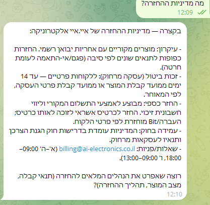

# 7. End-to-end tests

The brief's final step (section 12.7) is a run through the whole system. These are the tests I ran against the live system — real Airtable data, real Telegram bots, real Gmail and Drive — with the n8n execution number of each, so every result can be checked in **Executions**.

## Summary

| # | Test | Workflows | Result |
|---|---|---|---|
| 1 | Fill the vector store | WF6, WF7 | ✅ 62 policy chunks, 34 products |
| 2 | Customer bot — product questions | WF5 | ✅ real products, prices and SKUs |
| 3 | Owner bot — "מה ההכנסות?" | WF9 | ✅ numbers match Airtable exactly |
| 4 | Owner bot — a policy question | WF9 | ✅ answered from the returns policy |
| 5 | Invoice from the app → Drive → link in the app | WF13, WF1, WF8 | ✅ VAT 18%, document in Drive, `PdfUrl` set |
| 6 | Invalid documents are rejected | WF1 | ✅ every problem listed in `ValidationError` |
| 7 | Lead from the app → cold email → reply → answer | WF13, WF3, WF4a, WF4b | ✅ New → Contacted → Replied |
| 8 | Duplicate lead | WF3 | ✅ older lead with the same email found |
| 9 | App API — list, create, chat, bad action | WF13 | ✅ all four answer as documented |
| 10 | The app itself | Lovable + WF13 | ✅ dashboard, tables, forms, chat |

---

## 1 · Fill the vector store — WF6, WF7

Ran WF6 by hand, then WF7.

**Result:** the 12 policy topics in `עריכת שדות` were split into **62 chunks** (execution 5874) and the **34 products** from Airtable were embedded (execution 5926). Both stores (`policies`, `products`) are in memory — they are re-filled the same way after an n8n restart.

## 2 · Customer bot — product questions — WF5

Asked the customer bot `תבדוק לי אם יש אוזניות זמינות במלאי ומה המחיר שלהן?` (execution 5925).

**Result:** the agent called `search_products` and listed the three headphone models in the catalogue — TY-200 (TY-HP-200) 349 ₪, TY-Buds Pro (TY-EB-300) 289 ₪, TY-Gamer H7 (TY-GH-700) 429 ₪ — all in stock, all matching Airtable. It then offered to compare them or help order.

A price question about a specific product (a 27-inch monitor) returned its SKU, price and stock status the same way:

## 3 · Owner bot — "מה ההכנסות?" — WF9

Asked the owner bot `מה ההכנסות?` (execution 5906), with INV-1001 (12,400 + 2,232 VAT, open) and INV-1002 (4,850 + 873 VAT, paid) in Airtable.

**Result:** total 20,355 ₪ with VAT (2 invoices), 17,250 ₪ before VAT, 3,105 ₪ VAT, 5,723 ₪ paid (INV-1002), 14,632 ₪ open (INV-1001), no tax invoices or receipts. Every number matches the table: 12,400 + 4,850 = 17,250 and 2,232 + 873 = 3,105.

**Access control:** the bot answers only the chat id in `Is Owner?`; anyone else gets `Deny` ("הבוט הזה מיועד לבעל העסק בלבד") and no data.

## 4 · Owner bot — a policy question — WF9 + WF6

Asked the owner bot about the returns policy.

**Result:** the agent used its policies tool (`Answer questions with a vector store`) and summarized the return and refund rules from the WF6 text.

## 5 · The invoice cycle — WF13 → WF1 → WF8

Created an invoice through the app's webhook with the fields the form sends — customer `רותם טכנולוגיה`, amount `3200`, date 29/09/2026, due 29/10/2026, status "פתוחה".

| Step | Execution | What happened |
|---|---|---|
| WF13 `create` | 5963 | `INV-1003`, `DocNumber` 1003 (the next number), VAT 18% → `VATAmount` 576, `Total` 3,776, `Status = Issued` |
| WF1 | 5965 | the Airtable trigger fired, `Validate` found nothing wrong, `Files` row `Invoice-1003` = Pending, WF8 started |
| WF8 | 5967 | Hebrew RTL HTML → `Invoice-1003.html` (`text/html`) in Drive → `Files` = Done → `PdfUrl` on INV-1003 |
| WF13 `list` | 5970 | the invoices screen shows INV-1003 with its "מסמך" link |

From the form to the link in the app took about 15 seconds.

## 6 · Invalid documents — WF1

Ran WF1 with test documents (executions 5930, 5931, 5999; the Airtable writes were pinned so no test record was created):

| Document | `ValidationError` |
|---|---|
| tax invoice, 1,000 ₪ at 17% VAT dated 2026, no business number | `VATRate צריך להיות 0.18; VATAmount לא תואם Subtotal*VATRate; בחשבונית מס חובה מספר עוסק של הלקוח` (execution 5999) |
| receipt with no number, no customer, no amount | `DocNumber חסר או לא חיובי; חסר לקוח (CustomerId או CustomerName); Amount חייב להיות חיובי` |
| tax invoice, 1,000 ₪ + 180 ₪ = 1,180 ₪, with a business number | valid → queued for WF8 |
| receipt, 500 ₪ | valid → queued for WF8 |

This test found a real bug: a 17% rate on a 2026 invoice passed, because `0.18 − 0.17` in floating point is just under the 0.01 tolerance. The rate check now uses 0.001, and execution 5999 (the first row) shows the wrong rate caught.

## 7 · The lead cycle — WF13 → WF3 → WF4a → WF4b

Created a lead through the app's webhook: `שירה גולן`, `גולן עיצובים`, interested in wireless headphones for a team of 10 designers.

| Step | Execution | What happened |
|---|---|---|
| WF13 `create` | 5964 | `LEAD-0006`, email `guycgai+lead6@gmail.com` (demo alias), `Status = New` |
| WF3 | 5968 | no older lead with that email → stays `New` |
| WF4a | 5966 | the LLM wrote a personal Hebrew email, sent as HTML → `Status = Contacted`, `GmailThreadId` stored |
| reply | — | answered the email from the lead's inbox: "כן ביום רביעי בשעה 11:00 בבוקר" |
| WF4b | 5969 | matched the thread, the agent confirmed the Wednesday 11:00 call in the same thread → `Status = Replied` |

## 8 · Duplicate lead — WF3

Ran WF3 with two new leads (execution 5929): one with the email of LEAD-0001 written as ` GuyCGAI+lead1@gmail.com ` (capitals and spaces), one with a new email. The Airtable search ran for real; only the final update was pinned.

**Result:** after normalizing, the first lead matched the older LEAD-0001 and went to `Mark Dead`; the second found nothing and stayed `New`.

## 9 · The app API — WF13

| Request | Response |
|---|---|
| `{"action":"list","table":"tasks"}` | `{"records":[{"id":"TASK-0001","title":"לתאם שיחה עם יוסי מזרחי","owner":"גיא","due":"29/09/2026","status":"להיום","priority":"דחוף"}]}` |
| `{"action":"list","table":"receipts"}` (an empty table) | `{"records":[]}` |
| `{"action":"create","table":"invoices",…}` | `{"ok":true,"success":true,"id":"rec…","record":{"InvoiceId":"INV-1003",…}}` (test 5) |
| `{"action":"chat","message":"מה מדיניות האחריות על אוזניות?"}` | `{"reply":"…"}` — the warranty periods and what the warranty covers, from the policies |
| `{"action":"banana"}` | HTTP 400 `{"success":false,"error":"פעולה לא נתמכת"}` |

## 10 · The app — Lovable

Opened the published app: the dashboard shows this month's revenue, open invoices, leads by status and today's task; the invoices screen shows INV-1003 with its document link; the leads screen shows שירה גולן; the chat panel answers from the policies. Screenshots in [docs/05](05-app.md).

---

**Coverage:** every one of the ten workflows ran against real data — WF6/WF7 (1), WF5 (2), WF9 (3, 4), WF1 and WF8 (5, 6), WF3/WF4a/WF4b (7, 8), WF13 (5, 7, 9, 10). Screenshots of each run, with a green check on every node that ran, are in [docs/04](04-workflows.md).
